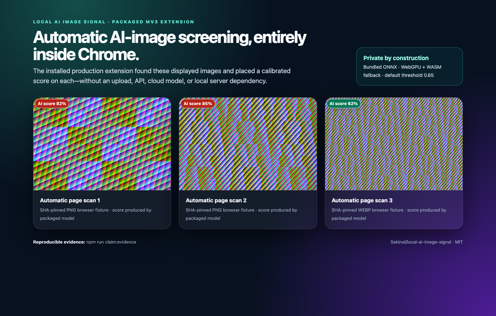

# POIDH claim package

This page is the compact evidence index for the [local AI image detector Chrome bounty](https://poidh.xyz/arbitrum/bounty/323). It describes release v1.1.1. The maintainers' private benchmark has not been seen, and the public measurements below are not presented as its result.



## Claim fields

**Title**

> Local AI Image Signal — private, offline Chrome AI-image screening

**Description**

> Public source and build instructions: https://github.com/Sekinal/local-ai-image-signal
>
> Release v1.1.1: https://github.com/Sekinal/local-ai-image-signal/releases/tag/v1.1.1
>
> Local AI Image Signal is an MIT-licensed native Manifest V3 Chrome extension. It automatically analyzes displayed `` and CSS-background images on ordinary HTTP(S) pages and places a calibrated AI score beside every analyzed image. The required default decision threshold is exactly 0.65.
>
> All inference stays inside Chrome. The packaged FP16 Community Forensics ONNX model runs through bundled ONNX Runtime Web, preferring WebGPU and falling back to WASM. There is no cloud inference, external API, telemetry, image upload, native messaging, localhost dependency, or runtime model download. The release ZIP includes the model and matching WASM assets, so it continues working after internet access is disabled except for ordinary image URLs already used by the page.
>
> Clean reproduction: `npm ci && npm run model:fetch && npm run verify:release`. The release gate checks formatting, strict lint and TypeScript, 31 unit/component tests, a production MV3 build, deterministic packaging, real-Chrome WebGPU and forced-WASM inference, Python/Chrome preprocessing parity, and automatic page badges. Main CI is green.
>
> Honest public development/calibration evidence at the fixed 0.65 threshold: clean/web/hard balanced accuracy 95.30% / 93.59% / 89.82%; low-quality macro balanced accuracy 75.84%; recent-HF low-quality fake recall 58.33%; OpenRouter low-quality fake recall 45.37%. These are not claims about the private bounty benchmark. Known failures—including tiny composites and extreme multi-hop degradation—are published in the model card.
>
> Requirement matrix: https://github.com/Sekinal/local-ai-image-signal/blob/v1.1.1/docs/BOUNTY_COMPLIANCE.md
>
> Model card and limitations: https://github.com/Sekinal/local-ai-image-signal/blob/v1.1.1/docs/MODEL_CARD.md
>
> Exact training/evaluation source: https://github.com/Sekinal/local-ai-image-signal-training
>
> Immutable model/checkpoint/report bundle: https://huggingface.co/Thermostatic/community-forensics-low-quality-detector-2026-08/tree/6fca3e7f4365363ee5c0fdb1a17d73917d54413d

## Requirement-to-evidence index

| Bounty requirement               | Evidence                                                                                     |
| -------------------------------- | -------------------------------------------------------------------------------------------- |
| MIT and fully open source        | [`LICENSE`](../LICENSE), `package.json`, committed source and lockfile                       |
| Native Manifest V3               | Generated manifest plus [`docs/ARCHITECTURE.md`](ARCHITECTURE.md)                            |
| Browser-local inference          | Bundled ONNX Runtime Web, model, WebGPU/WASM; [`docs/THREAT_MODEL.md`](THREAT_MODEL.md)      |
| Offline after setup              | Release ZIP contains all inference assets; the release gate runs installed-package inference |
| Automatic ordinary-page analysis | `entrypoints/auto-label.content.ts` and `npm run test:e2e:auto`                              |
| Score for every analyzed image   | Automatic overlay and popup both render calibrated scores                                    |
| Fixed 0.65 threshold             | Model contract and default settings; raw/logit mapping is documented                         |
| Reproducible build               | `package-lock.json`, immutable model revision/hash, `npm run verify:release`, green CI       |
| Reproducible training/evaluation | Public training repository plus immutable full checkpoints/manifests/reports                 |
| No lookup/circumvention          | No private benchmark material; fixture hashes only guard deterministic parity bytes          |

## Evidence image reproduction

From a verified production build:

```bash
npm ci
npm run model:fetch
npm run build
npm run claim:evidence
```

The script loads the packaged extension into a clean Chrome profile, serves three deterministic SHA-pinned parity fixtures on an ordinary local HTTP page, waits for automatic model scores, and writes `docs/assets/poidh-claim.png`. The fixtures demonstrate the shipped automatic UI and inference path; they are not an accuracy benchmark.
